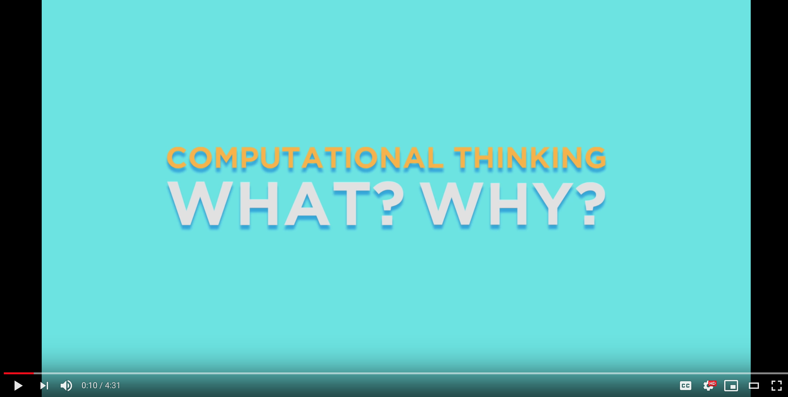

### Coding Workstation [Learning Styles] 🎓
____________________________________________________________________________________
Let's spend a few minutes thinking 💭 about your learning type. What makes you tick? What strategies work for you in terms of learning.

Do you need to touch it ✋ to learn, are you an avid YouTuber 📺, or do you bank on audio 🔉 files to learn?

Have you ever wondered why you do better in some classes than others? It may depend on your learning style. Your learning style influences the way you understand information and solve problems.

Studies show that varying your study methods and materials will improve your retention and recall of information, and enhance your learning experience. The "learning pyramid", sometimes referred to as the "cone of learning", developed by the National Training Laboratory, suggests that most students only remember about 10% of what they read from textbooks, but retain nearly 90% of what they learn through teaching others.

The Learning Pyramid model suggests that some methods of study are more effective than others and that varying study methods will lead to deeper learning and longer-term retention.

There are three primary learning styles:

### Computational Thinking Model
____________________________________________________________________________________

Computational Thinking (CT) is a problem solving process that includes a number of characteristics and dispositions. CT is essential to the development of computer applications, but it can also be used to support problem solving across all disciplines, including the humanities, math, and science. Students who learn CT across the curriculum can begin to see a relationship between academic subjects, as well as between life inside and outside of the classroom.

The coding workstations provides an opportunity to experience some of the elements of CT, including:

**Decomposition:** Breaking down data, processes, or problems into smaller, manageable parts
**Pattern Recognition:** Observing patterns, trends, and regularities in data
**Abstraction:** Identifying the general principles that generate these patterns
**Algorithm Design:** Developing the step by step instructions for solving this and similar problems

### Shameless Plug cThink
____________________________________________________________________________________

**cThink** (computational thinking) is a MVP progressive web app that focuses on the abstraction piece of the computational thinking model. It also borrows aspects of the learning pyramid that allows code newbies to utilize the   Draw ✏️, Act 🎭, Build 🔧 **{D.A.B}** pedagogy. **{D.A.B}** helps code newbies retain complex coding concepts by associating them with personalized analogies, building them out, and saving their process.

http://bit.ly/cThinkTimelineV2

### Learning Style Assesment
____________________________________________________________________________________
Many people use a combination of learning styles, whereas others learn best by using just one. Want to know your learning style? You're just 30 questions away from finding out!

https://www.how-to-study.com/learning-style-assessment/

### How To Submit
____________________________________________________________________________________
1. Take a snapshot of your learning style results
2. Submit it on Google Classroom