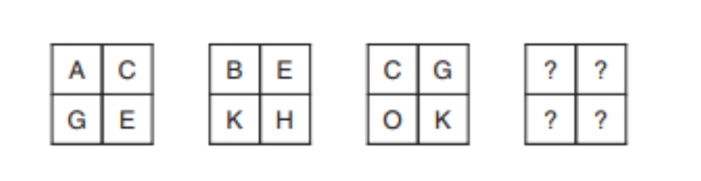

### Coding Workstation [Logic] 🔎
____________________________________________________________________________________
Logic programming is a computer programming paradigm in which program statements express facts and rules about problems within a system of formal logic. Rules are written as logical clauses with a head and a body; for instance, "H is true if B1, B2, and B3 are true."

### LightBot
____________________________________________________________________________________
LightBot is a puzzle game based on coding; it secretly teaches you programming logic as you play!

http://lightbot.com/flash.html

### How To Submit LightBot
____________________________________________________________________________________
1. Take a snapshot of your certificate
2. Submit it on Google Classroom

### Logical Reasoning Challenge
____________________________________________________________________________________
Students will have to recognize patterns in order to come up with a solution.
Your job is to fill out the last box, provided data from the three other boxes.

### How to Submit Logical Reasoning Challenge
____________________________________________________________________________________
1. Open up a Google doc
2. Write down your logic
    - Consider revisiting the computational thinking model to assist with solving this problem
3. Copy the Google doc url link 
4. Submit it on Google Classroom

### Water Bottle Challenge
____________________________________________________________________________________
You have a 3 and a 5-gallon water container, each container has no markings except for that which gives you it's total volume. You also have a running tap. You must use the containers and the tap in such a way as to exactly measure out 4 liters of water.

How is this done? You have 5 minutes to write out your algorithm with your team.

### How To Submit Water Botle Challenge
____________________________________________________________________________________
1. Open up a Google document
2. Write out your algorithm
3. Submit it on Google Classroom