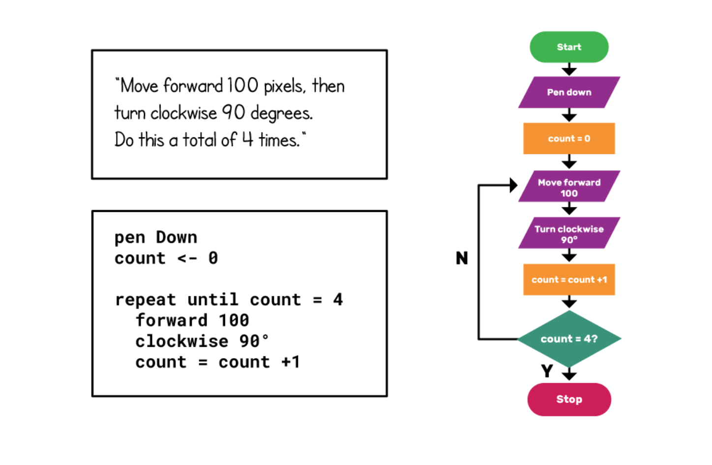

### Coding Workstation [Algorithms] 📝
____________________________________________________________________________________
Algorithm Design is 1 of 4 parts of the computational thinking model. An algorithm can simply be defined like this: - An algorithm is set of instructions that precisely describe an activity. The instructions should be such that any ‘actor’ could follow to produce the same output. An ‘actor’ refers to anything, whether human or computer, that is capable of computation.

Algorithms are used every day all around us to do all sorts of things, such as finding a route from A to B, searching the internet for the most appropriate pages, or recommending movies based on your past viewing.

In fact, it is difficult to think of a task performed by your computer that does not use algorithms. Algorithms are unambiguous specifications for performing calculation, data processing, automated reasoning, and other tasks.

While we could substitute the words instructions for algorithm, there are some important characteristics of algorithms that make them distinct.

**An algorithm:**

**1.** Must be sufficiently precise and unambigious: every step must be clear to the actor implementing the algorithm.
**2.** Must be repeatable, producing predictable outcomes based on the same inputs.
**3.** Can be represented in a range of forms, including natural language, pseudocode, flowcharts, or symbols.

### Solve the Tower of Hanoi Puzzle
____________________________________________________________________________________
You have a 3 and a 5-gallon water container, each container has no markings except for that which gives you it's total volume. You also have a running tap. You must use the containers and the tap in such a way as to exactly measure out 4 liters of water.

How is this done? You have 5 minutes to write out your algorithm with your team.

### How To Submit
____________________________________________________________________________________
1. Open up a Google document
2. Write out your algorithm
3. Submit it on Google Classroom