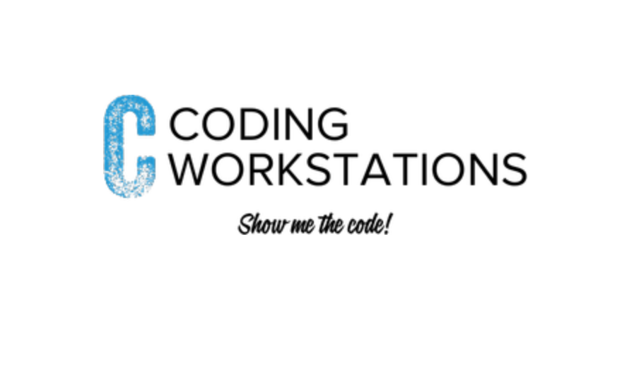

### About me: https://www.linkedin.com/in/heribertoroman/

The Coding Workstations are comprised of small repetitive coding prompts derived from the ideology of the [cThink](https://github.com/getromandev/cThink) platform. The goal is to provide students with visual, audio, and kinesthetic learning types, an opportunity to get their hands dirty and acquire a level of competency with lite Computer Science & Javascript fundamentals.

### Steps for Instructors
____________________________________________________________________________________
1. Set up tables facing each other that resembles a workstation.
2. Label each table with the appropriate coding station tag.
3. Prompt the students that the end goal is to complete each coding workstation
4. In order to pass students must complete all the prompts for each coding workstation then tested on those prompts via live coding, proctored by the instructor.
    - Each coding work station is worth x points.
    - Each student gets x minutes to complete live coding
5. Once the student has completed a coding work station and passed the live coding test move student to the next table.

### Steps for Students
______________________________________________________________________________________
Each coding workstation lives in a git branch please follow these steps to check in or out to a specific coding workstation branch.

1. Navigate to the following URL **https://github.com/getromandev/codingWorkstations**
2. Click on the **fork** button
    - This will create a copy of the codingWorkstations repository on your github account
3. Navigate to codingWorkstation repository you just forked
4. Click on the clone repository green button
5. Open your terminal
6. CD into your working directory
7. Type **git clone https://github.com/getromandev/codingWorkstations.git** in your terminal
8. CD into your new codingWorkstations folder
9. Check into the first coding workstation by typing **git checkout [branchName]**
    - In order to see the list of coding workstations in your terminal type:
        - **git branch**
    - You will see a list of coding workstations displayed
    - Select your coding workstation and type **git checkout [branchName]**
10. Open up your favorite text editor and get to work
